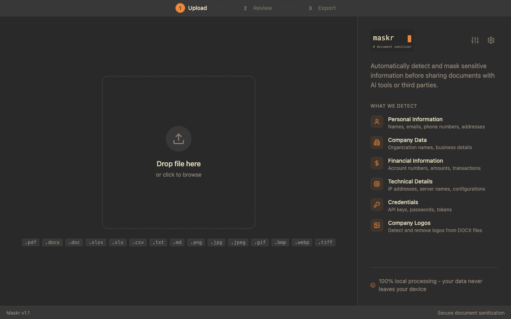
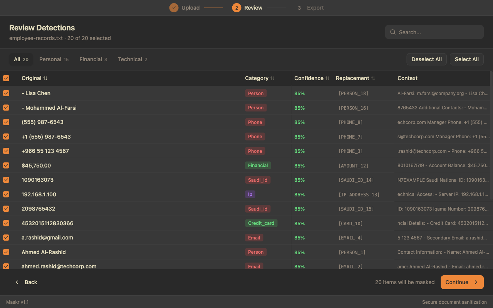
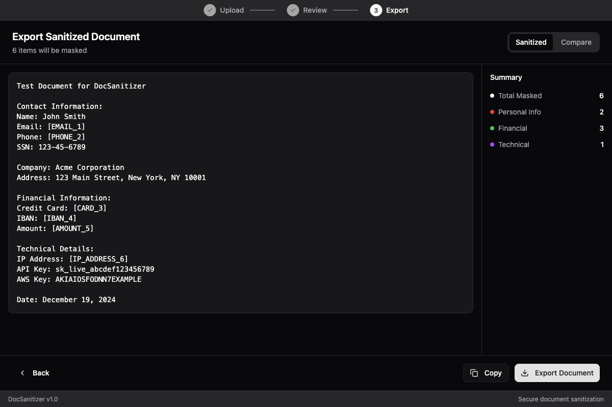

<p align="center">
  
</p>

<h1 align="center">DocSanitizer</h1>

<p align="center">
  <strong>A privacy-focused desktop app for detecting and masking sensitive information in documents</strong>
</p>

<p align="center">
  <a href="#screenshots">Screenshots</a> •
  <a href="#features">Features</a> •
  <a href="#installation">Installation</a> •
  <a href="#usage">Usage</a> •
  <a href="#supported-formats">Formats</a> •
  <a href="#contributing">Contributing</a>
</p>

<p align="center">
  
  
  
  
  
</p>

---

## Why DocSanitizer?

Before sharing documents with AI assistants, cloud services, or external parties, you need to ensure sensitive information is properly masked. DocSanitizer runs **100% locally** on your machine - no data ever leaves your device.

## Screenshots

### 1. Upload Your Document
Drag and drop or browse to select any supported document format. The sidebar shows what types of sensitive information will be detected.

<p align="center">
  
</p>

### 2. Review Detections
See all detected sensitive information organized in a table with categories, confidence scores, replacements, and context. Filter by type and toggle items on/off.

<p align="center">
  
</p>

### 3. Export Sanitized Document
Preview the sanitized document with all sensitive data replaced by placeholders. View a summary of masked items by category, then export.

<p align="center">
  
</p>

## Features

### Privacy First
- **100% Local Processing** - All analysis happens on your device
- **No Internet Required** - Works completely offline
- **No Telemetry** - Zero data collection or tracking
- **No Cloud Services** - Your documents stay on your machine

### Smart Detection
- **Email Addresses** - Personal and corporate emails
- **Phone Numbers** - US, UK, Saudi, and international formats
- **Credit Cards** - With Luhn algorithm validation
- **Social Security Numbers** - US SSN format
- **IBANs** - International bank account numbers with validation
- **IP Addresses** - Both IPv4 and IPv6
- **API Keys & Tokens** - AWS keys, API tokens, secrets
- **Custom Names** - Add your own names to detect
- **Custom Keywords** - Define project-specific terms

### Advanced Capabilities
- **OCR Support** - Extract and scan text from images using Tesseract.js
- **Logo Detection** - Detect and remove company logos from DOCX files using perceptual hashing
- **Confidence Scores** - Each detection includes a confidence rating
- **Entity Consistency** - Same entity always maps to the same placeholder
- **Configuration Profiles** - Save and switch between detection settings

## Supported Formats

| Format | Parse | Export | OCR | Logo Detection |
|--------|-------|--------|-----|----------------|
| TXT    | Yes   | Yes    | -   | -              |
| MD     | Yes   | Yes    | -   | -              |
| JSON   | Yes   | Yes    | -   | -              |
| CSV    | Yes   | Yes    | -   | -              |
| HTML   | Yes   | Yes    | -   | -              |
| DOCX   | Yes   | Yes    | -   | Yes            |
| XLSX   | Yes   | Yes    | -   | -              |
| PDF    | Yes   | Yes    | -   | -              |
| PNG    | Yes   | -      | Yes | -              |
| JPG    | Yes   | -      | Yes | -              |
| WebP   | Yes   | -      | Yes | -              |

## Installation

### Prerequisites

- **Node.js** 20.19+ or 22.12+ (required by Vite 7)
- **npm** (comes with Node.js)

### Quick Start

```bash
# Clone the repository
git clone https://github.com/iYassr/DocSanitizer.git
cd DocSanitizer

# Install dependencies
npm install

# Start development server
npm run dev
```

### Building for Production

```bash
# Build and package the application
npm run build
```

The packaged application will be available in the `release` directory.

### Platform-Specific Builds

The build process automatically creates installers for your current platform:
- **macOS**: `.dmg` file
- **Windows**: `.exe` installer
- **Linux**: `.AppImage` and `.deb` packages

## Usage

### Basic Workflow

1. **Upload** - Drag and drop a document or click to browse
2. **Review** - See detected sensitive information with confidence scores
3. **Customize** - Toggle individual detections on/off
4. **Export** - Save the sanitized document

### Configuration Options

#### Custom Names & Keywords
Click the sliders icon to add:
- **Custom Names** - Employee names, client names, etc.
- **Custom Keywords** - Project names, confidential terms

These will be detected with 100% confidence.

#### Logo Detection (DOCX only)
1. Click the gear icon
2. Upload your company logo (PNG, JPG, WebP)
3. Adjust similarity threshold (default: 85%)
4. Enable detection

### Keyboard Shortcuts

| Shortcut | Action |
|----------|--------|
| `Cmd/Ctrl + O` | Open file |
| `Cmd/Ctrl + S` | Export sanitized document |
| `Cmd/Ctrl + 1` | Original view |
| `Cmd/Ctrl + 2` | Sanitized view |
| `Cmd/Ctrl + 3` | Side-by-side view |

## Detection Categories

| Category | Color | Examples |
|----------|-------|----------|
| **PII** | Red | Names, emails, phones, SSN |
| **Company** | Blue | Organization names, logos |
| **Financial** | Green | Credit cards, IBANs, amounts |
| **Technical** | Purple | IP addresses, API keys |
| **Custom** | Yellow | User-defined keywords |

## Configuration Profiles

DocSanitizer includes preset profiles:

- **Default** - Balanced detection for common PII
- **Strict** - Maximum detection, lower confidence threshold
- **Minimal** - Only emails and phone numbers

Create custom profiles via the Profiles menu.

## Tech Stack

| Technology | Purpose |
|------------|---------|
| Electron 39 | Cross-platform desktop |
| React 19 | UI framework |
| TypeScript 5 | Type safety |
| Vite 7 | Build tool |
| Tailwind CSS 4 | Styling |
| Zustand | State management |
| Tesseract.js | OCR engine |
| Sharp | Image processing |
| mammoth | DOCX parsing |
| ExcelJS | XLSX handling |
| pdf-lib | PDF handling |

## Troubleshooting

### Node.js Version Error
```bash
# Using nvm
nvm install 22
nvm use 22
```

### Logo Detection Not Working
- Ensure Sharp is installed: `npm install sharp`
- Logo detection only works with DOCX files
- Try lowering the similarity threshold

### OCR Issues
- Use clear, high-resolution images
- Supported: PNG, JPG, JPEG, GIF, BMP, WebP, TIFF

## Contributing

Contributions are welcome! Please see [CONTRIBUTING.md](CONTRIBUTING.md) for guidelines.

### Development

```bash
# Run in development mode
npm run dev

# Type checking
npm run typecheck

# Linting
npm run lint

# Run tests
npm test
```

## License

This project is licensed under the MIT License - see the [LICENSE](LICENSE) file for details.

## Acknowledgments

- [Tesseract.js](https://tesseract.projectnaptha.com/) for OCR capabilities
- [Radix UI](https://www.radix-ui.com/) for accessible components
- [Tailwind CSS](https://tailwindcss.com/) for styling

---

<p align="center">
  Made with privacy in mind
</p>
